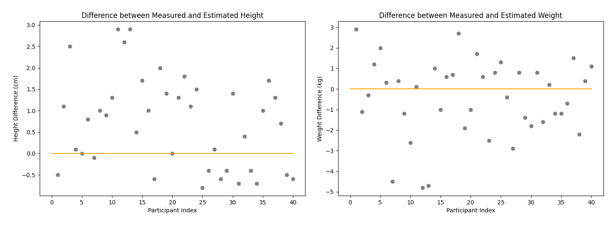
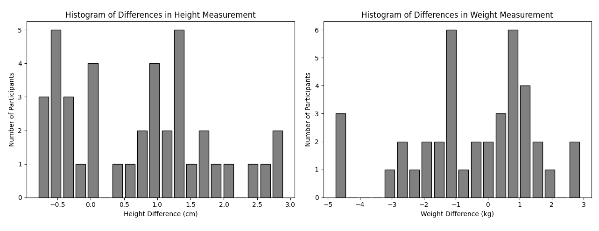
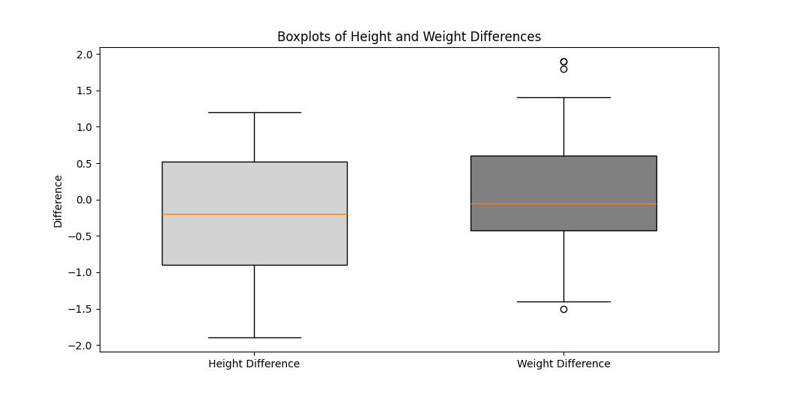
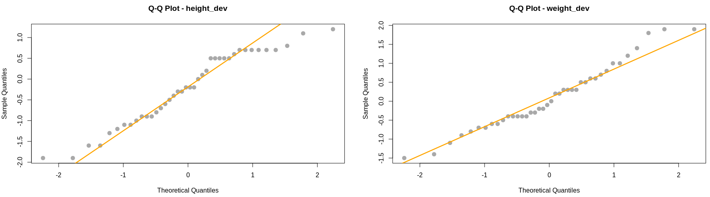
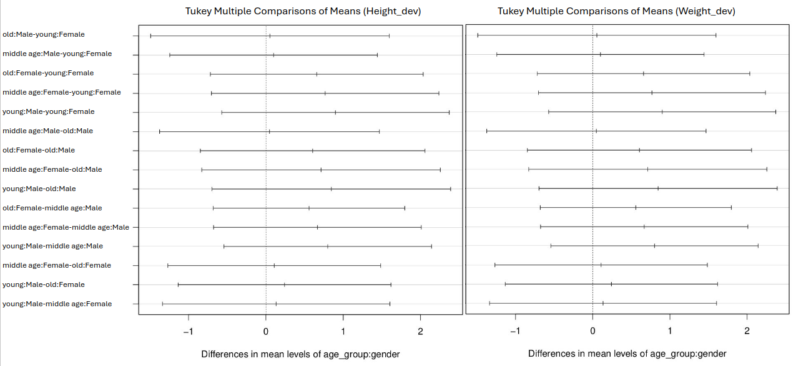

# Wissenschaftliche Methodik I (Projekt)

    Winter 2024

## **Project Overview**

##### **Participants**

* 40 individuals (20 male, 20 female)

##### **Questions Explored**

* Age
* Gender
* Height
* Weight

##### **Key Measurements**

* Height
* Weight

## Retrieve data from the database

```R
library(RPostgreSQL)
library(readxl)
library(dplyr)
library(ggplot2)
library(gridExtra)
library(car)
library(multcomp)
library(igraph)
library(PerformanceAnalytics)
library(multcompView)


host = "82.165.61.139"
port = 5430
dbname = "Veg"
user = "TechBio"
password = "T3chB10!"

connect =  dbConnect(
                 dbDriver("PostgreSQL"), 
                 host=host, 
                 port=port, 
                 dbname=dbname,  
                 user=user, 
                 password=password
           )

tables = dbListTables(con)
print(tables)
```

  [1] "author"
  [2] "measurementresults"
  [3] "person"
  [4] "author"
  [5] "project"
  [6] "databasechangelog"
     ...

  **[91] "body.Author"**

    ...

  **[103] "body.Project"**
  [104] "\"body\".\"project\""
  **[105] "body.Person"
  [106] "body.MeasurementResults"**

```R
author = dbReadTable(con, "body.Author")
project = dbReadTable(connect, "body.Project")
print(author)
print(project)
```

    **body.Author                                             body.Project**

|     id     | name                |  | id | given_name | family_name | matrikel_nr | project_id  |
| :---------: | ------------------- | - | :-: | ---------- | ----------- | ----------- | ----------- |
|      1      | Test                |  | 1 | Loghman    | Samani      | 3585810     | **2** |
| **2** | **BodyPro11** |  |    |            |             |             |             |
|      3      | Project1            |  |    |            |             |             |             |
|      4      | Project2            |  |    |            |             |             |             |
|      5      | Project3            |  |    |            |             |             |             |
|            | ...                 |  |    |            |             |             |             |
|     11     | Project3            |  |    |            |             |             |             |

```R
join_ = "SELECT * FROM body.Person 
        INNER JOIN body.MeasurementResults 
        ON body.Person.id = body.MeasurementResults.person"   # no need for ""LIMIT 40"

data = dbGetQuery(con, join_)

print(data)

dbDisconnect(con)
```

  **data**

| id            | number         | gender | age | measured_weight | measured_height | estimated_height | estimated_weight | project_id | person        |
| ------------- | -------------- | ------ | --- | --------------- | --------------- | ---------------- | ---------------- | ---------- | ------------- |
| **1**   | Participant 1  | male   | 26  | 74.0            | 175.7           | 175              | 76               | 2          | **1**   |
| **2**   | Participant 2  | male   | 39  | 77.8            | 173.4           | 174              | 78               | 2          | **2**   |
| **3**   | Participant 3  | male   | 48  | 75.5            | 169.4           | 171              | 76               | 2          | **3**   |
| **...** | ...            | ...    | ... | ...             | ...             | ...              | ...              | ...        | **...** |
| **40**  | Participant 40 | female | 55  | 58.6            | 161.7           | 161              | 60               | 2          | **40**  |

---

## Analyse Data

```R
info = summary(data)
print(info)
```

| Variable                   | Min             | 1st Qu.         | Median          | Mean            | 3rd Qu.         | Max             |
| -------------------------- | --------------- | --------------- | --------------- | --------------- | --------------- | --------------- |
| id                         | 1.00            | 10.75           | 20.50           | 20.50           | 30.25           | 40.00           |
| number                     | N/A             | N/A             | N/A             | N/A             | N/A             | N/A             |
| gender                     | N/A             | N/A             | N/A             | N/A             | N/A             | N/A             |
| age                        | 17.00           | 26.75           | 36.00           | 36.02           | 44.25           | 59.00           |
| **measured_weight**  | **53.70** | **61.15** | **69.35** | **70.43** | **88.85** | **89.50** |
| **measured_height**  | **157.5** | **165.4** | **170.4** | **169.3** | **173.6** | **178.7** |
| **estimated_height** | **157.0** | **165.0** | **171.0** | **169.6** | **174.0** | **179.0** |
| **estimated_weight** | **55.00** | **62.00** | **69.50** | **70.95** | **78.75** | **89.00** |
| project_id                 | 2               | 2               | 2               | 2               | 2               | 2               |
| person                     | 1.00            | 10.75           | 20.50           | 20.50           | 30.25           | 40.00           |

```R
data$height_dev = data$measured_height - data$estimated_height
data$weight_dev = data$measured_weight - data$estimated_weight

par(mfrow=c(1,2), mar=c(4,4,2,1)) 

plot(1:40, data$height_dev, col="gray", xlab="Participant Index",
     ylab="Height Difference (cm)",
     main="Difference between Measured and Estimated Height")

abline(h=0, col="orange")

plot(1:40, data$weight_dev, col="gray", xlab="Participant Index",
     ylab="Weight Difference (kg)",
     main="Difference between Measured and Estimated Weight")

abline(h=0, col="orange")
par(mfrow=c(1,1), mar=c(5,4,4,2)+0.1)
```



```R
hist_height = ggplot(data, aes(x = height_dev)) +
  geom_histogram(binwidth = 1, color = "black", fill = "gray", alpha = 0.7) +
  labs(title = "Histogram of Differences in Height Measurement",
       x = "Height Difference (cm)",
       y = "Number of Participants") +
  theme_minimal()


hist_weight = ggplot(data, aes(x = weight_dev)) +
  geom_histogram(binwidth = 1, color = "black", fill = "gray", alpha = 0.7) +
  labs(title = "Histogram of Differences in Weight Measurement",
       x = "Weight Difference (kg)",
       y = "Number of Participants") +
  theme_minimal()

grid.arrange(hist_height, hist_weight, ncol = 2)
```



```R
par(mfrow = c(1, 2), mar = c(5, 4, 2, 2))  

boxplot(data$height_dev, horizontal = TRUE, col = "lightgray",
        main = "Boxplot of Height Differences",
        xlab = "Height Difference (cm)", 
        ylab = "Difference")

boxplot(data$weight_dev, horizontal = TRUE, col = "gray", 
        main = "Boxplot of Weight Differences",
        xlab = "Weight Difference (kg)", 
        ylab = "Difference")

par(mfrow = c(1, 1))
```



---

## Hypotheses

##### **Weight Hypothesis**

* Null Hypothesis (H0): There is **no significant difference between reported and measured weights** (**H0: μ = 0**)
* Alternative Hypothesis (H1): The differences in reported and measured weights are **significantly less than 0** (**H1: μ  < 0**)

##### **Height Hypothesis**

* Null Hypothesis (H0): There is **no significant difference between reported and measured heights** (**H0: μ  = 0**)
* Alternative Hypothesis (H1): The differences in reported and measured heights are **significantly greater than 0** (**H1: μ > 0**)

#### The normality of the data distribution

##### *quantile–quantile plot* (Q-Q-Plot)

```R
par(mfrow = c(1, 2))
qqnorm(data$height_dev, col = "darkgray", pch = 20, cex = 2, main = "Q-Q Plot - h_diff")
qqline(data$height_dev,  col = "orange", lty = 1, lwd = 2.5)

qqnorm(data$weight_dev, col = "darkgray", pch = 20, cex = 2, main = "Q-Q Plot - w_diff")
qqline(data$weight_dev, col = "orange", lty = 1, lwd = 2.5)

par(mfrow = c(1, 1))
```



#### Shapiro-Wilk

```R
h_diff = shapiro.test(data$height_dev)
w_diff = shapiro.test(data$weight_dev)

print(h_diff)
print(w_diff)
```

##### Shapiro-Wilk normality test (height_dev)                                                                    Shapiro-Wilk normality test (weight_dev)

    W = 0.94529,**p-value = 0.05228**                                                                                                             W = 0.96832,**p-value = 0.3179**

### **homogeneity of variance**

```R
group = as.factor(c(rep(1, length(data$height_dev)), rep(2, length(data$weight_dev))))

levene = leveneTest(c(data$height_dev, data$weight_dev), group)

print(levene)
```

Levene's Test for Homogeneity of Variance (center = median)
           Df   F-value   Pr(>F)
group  1     0.354    **0.5536**
      78

#### one-sample t-test

```R
t_test_height = t.test(data$height_dev, mu = 0, alternative = "greater")   
t_test_weight = t.test(data$weight_dev, mu = 0, alternative = "less")

print(t_test_height)                             
print(t_test_weight)
```

##### One Sample t-test (height_dev)                                                             One Sample t-test (weight_dev)

t = 2.6612, df = 39, **p-value = 0.005624**                                                                          t = 3.5337, df = 39, **p-value = 0.9995**
alternative hypothesis: true mean is greater than 0                                                         alternative hypothesis: true mean is less than 0
95 percent confidence interval:                                                                                         95 percent confidence interval:
 0.1265694       Inf                                                                                                                -Inf 0.7642481
sample estimates:                                                                                                             sample estimates:
mean of x                                                                                                                         mean of x
    0.345                                                                                                                              0.5175

#### Results:

for **height differences**, there is strong evidence that the **true mean is greater than 0**. However, for weight differences, **we do not have
sufficient evidence to conclude that the true mean is less than 0**.

---

---

# Gender Influence

#### **Hypotheses**

* **Null Hypothesis (H0):** There is no significant difference in the mean differences between self-reported and measured values for males and females.
* **Alternative Hypothesis (H1):** There is a significant difference in the mean differences between self-reported and measured values for males and females.

```R
g_split = split(data, data$gender)

m_data = g_split$Male
f_data = gender_split$Female

mh_diff = m_data$height_dev
fh_diff = f_data$height_dev

mw_diff = m_data$weight_dev
fw_diff = f_data$weight_dev
```

**Two-Sample t-test**

```R
p_value_height = var.test(mh_diff, fh_diff)$p.value  
p_value_weight = var.test(mw_diff, fw_diff)$p.value

t_test_height = t.test(mh_diff, fh_diff)   
t_test_height = t.test(mw_diff, fw_diff)

print(p_value_height)                    
print(p_value_weight)

print(t_test_height)                       
print(t_test_height)
```

###### Levene's Test (mh_diff, fh_diff)                                                                               Levene's Test (mw_diff, fw_diff)

0.5342558                                                                                                                            0.05307442

**Welch Two Sample t-test (mh_diff, fh_diff)                                                             Welch Two Sample t-test (mw_diff, fw_diff)**

t = 2.2075, df = 37.231, **p-value = 0.03352**                                                                      t = -0.37537, df = 32.122, **p-value = 0.7099**
alternative hypothesis: true difference in means is not equal to 0                                       alternative hypothesis: true difference in means is not equal to 0
95 percent confidence interval:                                                                                            95 percent confidence interval:
 0.05885992 1.37114008                                                                                                      -1.4457864  0.9957864
sample estimates:                                                                                                                 sample estimates:
mean of x mean of y                                                                                                             mean of x mean of y
    1.075     0.360                                                                                                                      -0.560    -0.335

based on the results, there is evidence of **a significant difference in reported and measured heights** between males and females, while there is

**no significant difference in reported and measured weights** between the two genders.

---

###  Full Factorial Experiment

##### Analyze the effects of gender and age on height and weight differences

* young:  age <= 28
* middle age: 28 < age < 42
* old:   42 <= age

```R
data$age_group = cut(data$age,
                      breaks = c(-Inf, 28, 42, Inf),
                      labels = c("young", "middle age", "old"),
                      include.lowest = TRUE)

subdata = data[c("number", "height_dev", "weight_dev", "gender", "age_group")]
print(subdata)
```


|     | number         | height_dev | weight_dev | gender | age_group  |
| --- | -------------- | ---------- | ---------- | ------ | ---------- |
| 1   | Participant 1  | -0.5       | 2.9        | Male   | young      |
| 2   | Participant 2  | 1.1        | -1.1       | Male   | middle age |
| 3   | Participant 3  | 2.5        | -0.3       | Male   | old        |
| 4   | Participant 4  | 0.1        | 1.2        | Male   | middle age |
| 5   | Participant 5  | 0.0        | 2.0        | Male   | middle age |
| ... | ...            | ...        | ...        | ...    | ...        |
| 40  | Participant 40 | -0.6       | 1.1        | Female | old        |


| Age \ Gender | Male              | Female            |
| ------------ | ----------------- | ----------------- |
| young        | Interaction1_m_y  | Interaction1_y_y  |
| middle age   | Interaction1_f_ma | Interaction1_f_ma |
| old          | Interaction1_m_o  | Interaction1_f_o  |

* Interaction1_m_y : interaction effect between male and young
* Interaction1_f_y : interaction effect between female and young
* Interaction1_m_ma : interaction effect between male and middle age
* Interaction1_f_ma : interaction effect between female and middle age
* Interaction1_m_o : interaction effect between male and old
* Interaction1_f_o : interaction effect between female and old

### Hypotheses

**Null Hypotheses (H0):**

* There is no significant difference in height differences between age groups.
* There is no significant difference in height differences between genders.
* There is no significant interaction effect between age and gender on height differences.
* Repeat the same for weight differences.

**Alternative Hypotheses (H1):**

* There is a significant difference in height differences between age groups.
* There is a significant difference in height differences between genders.
* There is a significant interaction effect between age and gender on height differences.
* Repeat the same for weight differences.

##### Two-way ANOVA

```R
model_height = aov(height_dev ~ age_group * gender, data = data)
model_weight = aov(weight_dev ~ age_group * gender, data = data)

h_summ = summary(model_height)
w_summ = summary(model_weight)

print(h_summ)
print(w_summ)
```


Df Sum Sq Mean Sq F value Pr(>F)                                                                                                      Df Sum Sq Mean Sq F value Pr(>F)
gender            1  0.272  0.2723   0.382 0.5406                                                                          gender            1  0.036  0.0360   0.052  0.822
age_group         2  0.030  0.0151   0.021 0.9790                                                                        age_group         2  1.594  0.7970   1.144  0.331
gender:age_group  2  4.904  2.4521   3.442 0.0435 *                                                               gender:age_group  2  2.894  1.4471   2.077  0.141
Residuals        34 24.223  0.7124                                                                                              Residuals        34 23.692  0.6968

Signif. codes:  0 ‘***’ 0.001 ‘**’ 0.01 ‘*’ 0.05 ‘.’ 0.1 ‘ ’ 1


##### Tukey Honest Significant Difference (Tukey HSD)

```R
h_tukey = TukeyHSD(model_height, "age_group:gender", ordered=TRUE)
w_tukey = TukeyHSD(model_weight, "age_group:gender", ordered=TRUE)
print(h_tukey)
print(w_tukey)
```


 Tukey multiple comparisons of means
    95% family-wise confidence level
    factor levels have been ordered

Fit: aov(formula = height_dev ~ age_group * gender, data = data)

$`age_group:gender`
                                        diff        lwr      upr     p adj
old:Male-young:Female             0.05333333 -1.4893056 1.595972 0.9999981
middle age:Male-young:Female      0.10000000 -1.2426949 1.442695 0.9999135
old:Female-young:Female           0.65833333 -0.7175195 2.034186 0.7005100
middle age:Female-young:Female    0.76666667 -0.7041819 2.237515 0.6209810
young:Male-young:Female           0.90000000 -0.5708485 2.370849 0.4508598
middle age:Male-old:Male          0.04666667 -1.3743080 1.467641 0.9999985
old:Female-old:Male               0.60500000 -0.8473466 2.057347 0.8053868
middle age:Female-old:Male        0.71333333 -0.8293056 2.255972 0.7292414
young:Male-old:Male               0.84666667 -0.6959723 2.389306 0.5685041
old:Female-middle age:Male        0.55833333 -0.6795702 1.796237 0.7490160
middle age:Female-middle age:Male 0.66666667 -0.6760282 2.009362 0.6674209
young:Male-middle age:Male        0.80000000 -0.5426949 2.142695 0.4801912
middle age:Female-old:Female      0.10833333 -1.2675195 1.484186 0.9998861
young:Male-old:Female             0.24166667 -1.1341862 1.617519 0.9945326
young:Male-middle age:Female      0.13333333 -1.3375152 1.604182 0.9997723

  Tukey multiple comparisons of means
    95% family-wise confidence level
    factor levels have been ordered

Fit: aov(formula = height_dev ~ age_group * gender, data = data)

$`age_group:gender`
                                        diff        lwr      upr     p adj
old:Male-young:Female             0.05333333 -1.4893056 1.595972 0.9999981
middle age:Male-young:Female      0.10000000 -1.2426949 1.442695 0.9999135
old:Female-young:Female           0.65833333 -0.7175195 2.034186 0.7005100
middle age:Female-young:Female    0.76666667 -0.7041819 2.237515 0.6209810
young:Male-young:Female           0.90000000 -0.5708485 2.370849 0.4508598
middle age:Male-old:Male          0.04666667 -1.3743080 1.467641 0.9999985
old:Female-old:Male               0.60500000 -0.8473466 2.057347 0.8053868
middle age:Female-old:Male        0.71333333 -0.8293056 2.255972 0.7292414
young:Male-old:Male               0.84666667 -0.6959723 2.389306 0.5685041
old:Female-middle age:Male        0.55833333 -0.6795702 1.796237 0.7490160
middle age:Female-middle age:Male 0.66666667 -0.6760282 2.009362 0.6674209
young:Male-middle age:Male        0.80000000 -0.5426949 2.142695 0.4801912
middle age:Female-old:Female      0.10833333 -1.2675195 1.484186 0.9998861
young:Male-old:Female             0.24166667 -1.1341862 1.617519 0.9945326
young:Male-middle age:Female      0.13333333 -1.3375152 1.604182 0.9997723

```R
plot(ht, las=1, col="#2b2929")
plot(wt, las=1, col="#2b2929")
```



